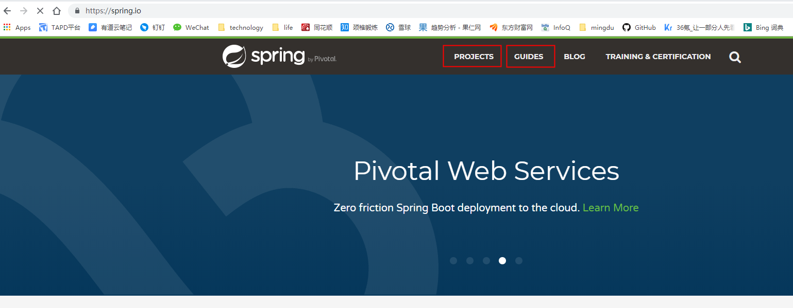

Spring Boot 基本使用

# 文档

# 1. 日志

Spring最开始在core包中引入的是commons-logging（JCL标准实现）的日志系统，官方考虑到兼容问题，在后续的Spring版本中并未予以替换，而是继续沿用。如果考虑到性能、效率，应该自行进行替换，在项目中明确指定使用的日志框架，从而在编译时就指定日志框架。 commons-logging日志系统是基于运行发现算法（常见的方式就是每次使用org.apache.commons.logging.LogFactory.getLogger(xxx),就会启动一次发现流程），获取最适合的日志系统进行日志记录，其效率要低于使用slf4j，在编译时明确指定日志系统的方式，目前常用的日志框架有logback、log4j2等。 
[官方文档](https://docs.spring.io/spring/docs/5.0.0.M5/spring-framework-reference/html/overview.html)推荐使用slf4j作为通用API框架。

## 1.1 slf4j和log4j2
slf4j实现了日志框架一些通用的日志api;
log4j2是具体的日志框架，是吸取log4j和logback的优点，进一步改进的日志框架，目前log4j2的性能更好一些。

slf4j和logback的关系和jdbc和其具体数据库的JDBC的jar包的关系类似。

使用方法： 参考

